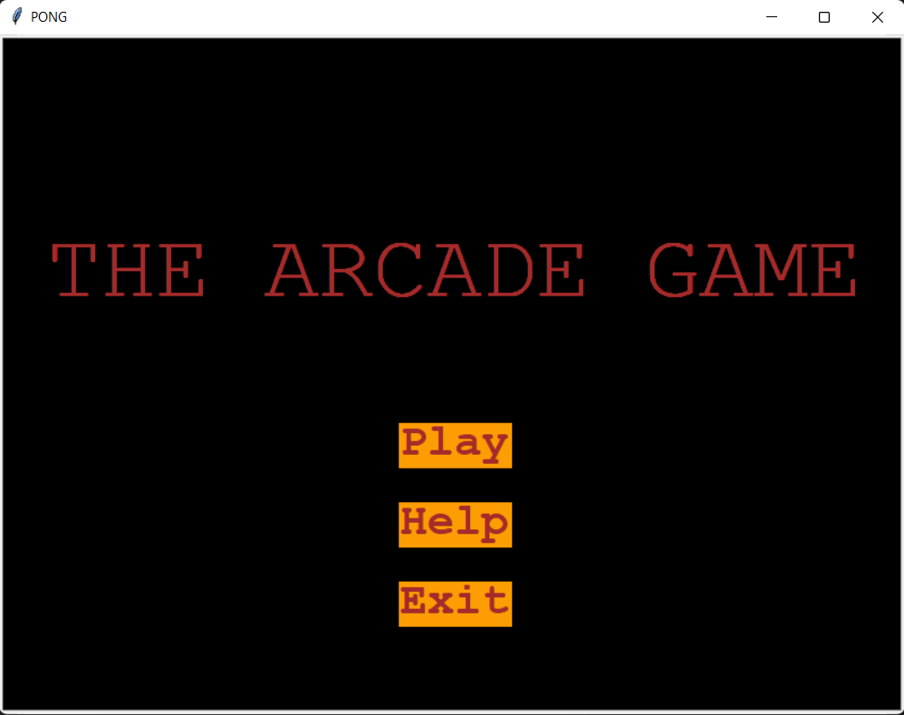
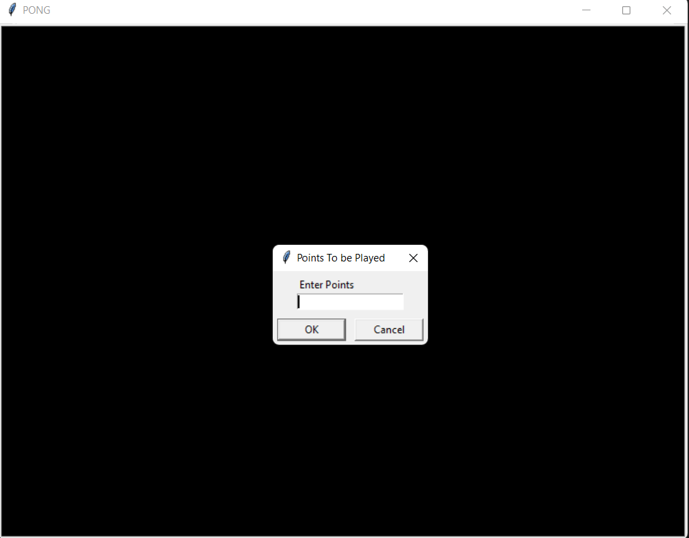
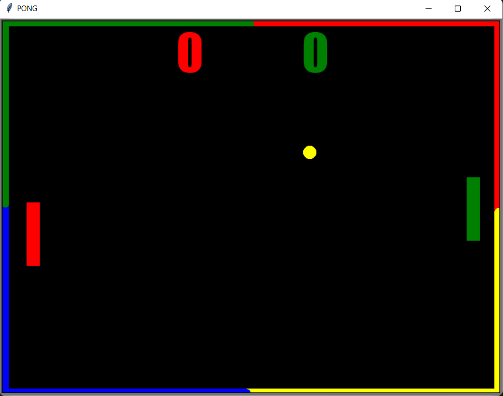
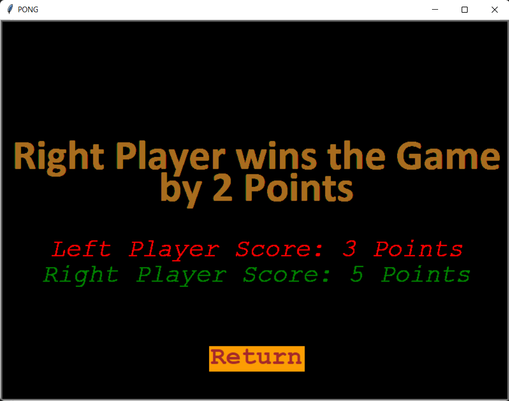
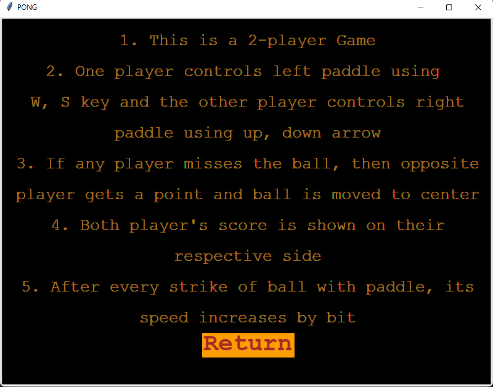

# **The Arcade Game**

This is a a simple 2-player game made completely using turtle library in python implemented in object-oriented programming (OOPs) way. The game contains a moving ball and a paddle for each player. The goal of each player in the game is to avoid  missing the ball by using their paddle and win the match.

## Game Demo

https://user-images.githubusercontent.com/100485953/216812044-3caaa818-5ca5-470f-8ab3-90d5cd80afa5.mp4

## Game Instructions

- As the game starts, prompt asks the players for the Game Points (a positive integer) to be played.
- One player controls left paddle using W, S key and the other player controls right paddle using up, down arrow.

- If any player misses the ball, then the opposite player gets a point and ball is moved to center of the screen.

- In this case, balls starts moving towards the player who scores a point with its speed set to the original speed.

- Both player's score is shown on their respective side.

- After every strike of ball with any paddle, its speed increases by a bit.

- Game finishes only when one of the player makes score equal to Game Points

- Whoever scores the Game points early in the game wins the match.

## Game Screens/Windows
>It contains the following screens in the game.
### Initial screen 

>This is the initial **front_page** of the game. It contains the title of the game.
There are three clickable buttons :

>1. *Play* - It redirects the player to the prompt for asking points.
>2. *Help* - It redirects the player to the help_page screen/window.
>3. *Exit* - On clicking Exit button, game will exit.

### Prompt for asking Game Points

>This is the **get_points** prompt of the game. It asks player to enter points of the match to be played.
On entering points, it redirects you to Main game screen.

### Main game screen 

>This is the **game_screen** of the game. It contains two paddles, scores of both the players and a moving ball which is initially positioned at the center of the screen. Both players can control their respective paddles using Control-keys to play the game.

>*Control-keys* :
>* *W*- It moves left paddle upwards
>* *S* - It moves left paddle downwards
>* *up-arrow* - It moves right paddle upwards
>* *down-arrow* - It moves right paddle downwards

### Game Over screen 

>This is the **game_over** page of the game. It displays which player has won the game by how many points along with final scores of the both the players in the match.
It contains a clickable Return button:
>>*Return* - It  redirects the player to Initial sreen / front_page of the game.

### Instructions Screen 

>This is the **help_page** of the game. It contains all the instructions for playing this game.
It contains a clickable Return button:
>>*Return* - It  redirects the player to Initial sreen / front_page of the game.

